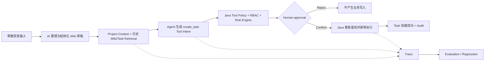
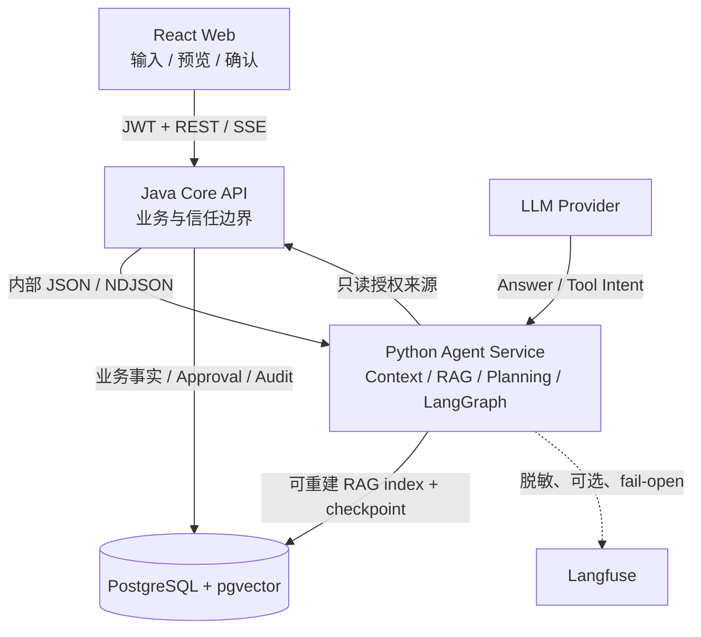

# AgentForge

**Reliable AI Agent Workspace for engineering collaboration.**

AgentForge 不是一个把 Wiki 接到聊天框上的知识库 Demo。这个项目研究的是 Agent 真正进入研发协作后会遇到的工程问题：上下文如何保持有界且不串项目，模型提出的 Tool Intent 如何经过权限与风险判断，哪些操作必须等待人工确认，服务重启后如何恢复，以及如何用 Trace 和 Evaluation 证明它做过什么、是否仍然可靠。

> AI 负责理解与决策；Java 确定性系统负责权限、审批和业务写入。

## 一条真正的 Agent 工作流

用户可以直接输入尚未整理的研发信息：

```text
今天讨论登录模块改造。
准备从 Session 改 JWT，还要加 Redis Token Blacklist。
后端这周完成，优先级比较高。
```

AgentForge 不止回答“Wiki 里写了什么”，而是把这段输入推进为一个受控工作流：



AI 整理结果可以是：

```markdown
# 登录模块改造

## 目标
- Session 迁移到 JWT
- 增加 Redis Token Blacklist

## Task
- 后端鉴权改造
- JWT 签发与验证
- Token 失效机制

优先级：HIGH
```

如果检索到已有的「登录模块设计」，Agent 可以结合项目上下文提出结构化 Task；在用户点击确认前，Task 不会被创建。确认后仍由 Java 重新检查项目权限、服务端 Tool Policy、目标版本和幂等键，Python/LLM 没有直接写业务表的权限。

## 我真正想解决的工程问题

| 工程问题 | AgentForge 的处理方式 | 证据入口 |
| --- | --- | --- |
| Context 不能无限增长，也不能串项目 | `ContextBundle` 组合 Recent Messages、Summary、Retrieved/Project/Tool Context；Token Budget 与 `tenant → workspace → project → user → thread` Namespace 共同约束上下文 | [Context Management](docs/03-features/context-management.md) |
| LLM 输出不能等于业务执行 | Python 只产生白名单 Tool Intent；Java 集中式 Tool Metadata、RBAC 和 Risk Engine 决定是否允许 | [Security & Risk](docs/03-features/security-and-risk.md) |
| 高风险动作必须由人决定 | Approval 状态机支持确认、拒绝、失败和重复请求；确认时再次鉴权 | [Approval / Idempotency / Audit](docs/03-features/approval-idempotency-and-audit.md) |
| 网络重试不能重复创建 Task | `Idempotency-Key`、行锁、乐观锁与追加式 Audit 共同保存确定性业务事实 | [Core API Contract](docs/04-api/core-api.md) |
| Agent 服务重启后不能丢失待确认动作 | PostgreSQL-backed LangGraph checkpoint 保存最小运行态，支持 interrupt、restart、resume 和 replay | [Agent Runtime](docs/03-features/agent-runtime.md) |
| Agent 行为必须可定位 | Langfuse Trace 关联 request/thread/project，覆盖 prepare、retrieval、tool、LLM、latency、usage 和脱敏 error；观测故障 fail-open | [Observability](docs/03-features/observability.md) |
| “看起来能用”不是质量证据 | 固定 dataset 和 runner 计算 RAG、Answer 与 Tool/Agent 指标；V2-09 再用完整 Release Regression 覆盖跨服务链路 | [Evaluation](docs/03-features/evaluation.md) |

RAG 在这里是 Project Context 的一个来源，不是产品本身。完整链路是：

`Project Context → Retrieval → Agent Decision → Tool Intent → Risk / Permission → HITL → Deterministic Execution → Persistence / Recovery → Trace → Evaluation`

## 架构与信任边界



- **React Web**：采集研发输入、增量预览 AI 整理结果、展示来源和待确认操作。
- **Python Agent Service**：负责 Context、Retrieval、Planning、Tool Intent 和可恢复 Agent State。
- **Java Core API**：拥有用户、Project、Wiki、Task、RBAC、Risk、Approval、Audit 与最终写入。
- **PostgreSQL**：保存业务事实、可重建的 pgvector 索引，以及与业务表隔离的 Agent checkpoint。

详细边界见[系统架构](docs/02-architecture/system-overview.md)、[Java/Python ADR](docs/02-architecture/decisions/ADR-0009-java-to-python-agent-boundary.md)和[数据架构](docs/02-architecture/data-architecture.md)。

## 当前状态与真实证据

- ✅ V1：Web → Java → Python Agent → RAG / Tool → Java 写回的完整可运行闭环。
- ✅ V2-01～V2-04：Trace、Context Manager、Conversation Summary / Token Budget、Memory Namespace 隔离。
- ✅ V2-05～V2-07：集中式 RBAC/Risk、持久化历史、五态 Approval、幂等/Audit、PostgreSQL checkpoint 与跨重启 resume。
- ✅ V2-08：可重复离线 Evaluation Pipeline。当前固定小数据集的真实基线为 Recall@K/MRR/Hit Rate `0.75`、确定性词项支持率 `0.833`、Tool Selection/Task Success `1.0`。这些数字只用于回归，不代表线上质量、统计显著性或完整语义正确性。
- ✅ V2-09：完整 Release Regression 已通过 11/11 个失败关闭阶段，覆盖普通问答、RAG、Tool/HITL、权限隔离、重复请求、restart/resume、Trace 和 Evaluation；`v2-stable` 只从已验证并推送的节点提交创建。
- 🧭 V3：MCP、Model Gateway、Multi-model Routing 与 GraphRAG 仍是规划项，未伪装成已实现能力。

每个节点的实现、失败测试、最终验证和独立 Review 都记录在[变更记录](docs/07-changes/README.md)与[审核记录](docs/08-reviews/README.md)。

## 本地运行

最快方式只需要 Git、PowerShell 和 Docker Desktop：

```powershell
.\scripts\setup-local-env.ps1
# 可选：在 .env 中配置 deepseek / zhipu / qwen；默认 disabled 无需外部 key
docker compose --env-file .env -f infra/compose.yaml up --build -d
.\scripts\demo\seed-v1.ps1
```

打开 `http://127.0.0.1:5173`，使用演示脚本输出的临时账号登录。真实模型 key、JWT secret、内部 token 和生产 `.env` 都不得提交；完整说明见[本地开发](docs/05-development/local-development.md)。

## 仓库导航

```text
apps/web/                   React Web
services/core-api/          Java 确定性业务服务
services/agent-service/     Python Agent Runtime
scripts/validation/         跨服务验收与 Release Regression
infra/                      Compose / PostgreSQL / pgvector
docs/                       架构、功能、ADR、变更与测试证据
```

- [文档中心](docs/README.md)
- [V2/V3 Node Roadmap](docs/01-product/v2-v3-node-roadmap.md)
- [测试策略](docs/05-development/testing-strategy.md)
- [当前变更：V2-09](docs/07-changes/2026-09-09-v2-09-regression-release.md)
- [公开仓库安全](docs/00-governance/public-repository-security.md)

## 生产边界

`infra/compose.prod.yaml` 使用 Nginx 作为唯一公网入口，PostgreSQL、Core API、Agent Service 和 Web 留在私有网络。单机公网 Demo 有注册开关、AI 日配额、IP 限速、模型输出预算、TLS、备份和 Git 回滚，但这不等同于宣称通用的 production-grade 平台。部署步骤与限制见[单机生产部署](docs/06-operations/production-single-host.md)。

任何修改都必须遵守 [AGENTS.md](AGENTS.md) 的文档先行、确定性职责、真实测试和敏感信息边界。
