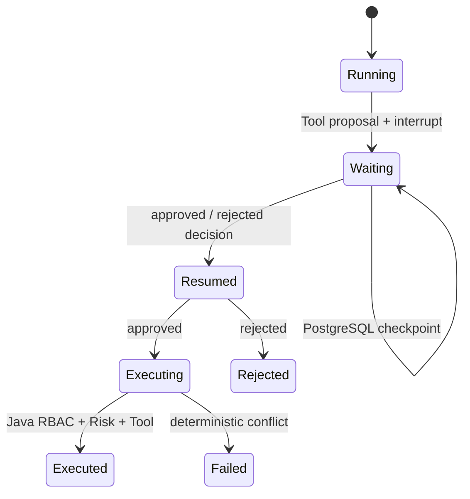

# Agent Runtime：持久化中断与恢复

- 状态：Implemented
- 所属阶段：V2-07
- 相关 ADR：ADR-0009、ADR-0011、ADR-0021、ADR-0022

## 用户价值

当 Agent 提出需要人工确认的业务动作时，等待状态不再依赖某个 Python 进程。即使 Agent Service 在确认前重启，用户仍可确认或拒绝原动作；系统恢复同一 Thread，并保证 Java 最多执行一次业务写入。

## 目标流程

1. Python 完成 Context、Retrieval、Tool planning 和回答生成。
2. 仅当存在有效 Tool proposal 时，Action workflow 以完整 Memory Namespace 派生的稳定物理 thread key 写入 checkpoint 并动态 interrupt；对外 Thread 标识仍是 `conversationId`。
3. Java 校验 proposal、持久化 PENDING Approval，并把 pending action 返回用户。
4. 用户 confirm/reject 后，Java 重新验证 Project、actor 和服务端 Tool Policy，并先持久化决定。
5. Java 使用内部凭据把 action、decision 和 Idempotency Key 发送给 Python Resume 接口。
6. Python 从 PostgreSQL 恢复相同 Thread；批准恢复成功后 Java 再锁定 Approval、再次复核权限并执行 Tool。
7. 任一网络响应丢失时，相同 key 重试返回已提交事实；不同 key 或相反 decision 冲突。

## 状态与隔离

checkpoint 只保存恢复所需的受限状态：schema version、tenant/workspace/project/user/thread、proposal 指纹、等待/恢复状态、action ID、decision、Idempotency Key 和 request ID。不得保存 JWT、服务间 token、密码、完整 Prompt、回答正文或检索正文。

Thread 恢复必须同时匹配完整 Memory Namespace。仅知道 conversation ID 不能跨 Project 或 User 恢复。等待期间相同 proposal 的重试返回原等待状态，另一个 Tool proposal 冲突；普通无 Tool Chat 不创建或覆盖 Action workflow。恢复完成后的新 proposal 会建立新一轮状态，同时保留 LangGraph checkpoint 历史。

## 一致性与重试

Java 不在数据库事务或 action 行锁内调用 Python。confirm 分为：

1. `PENDING → APPROVED` 与审计提交；
2. Python Resume；
3. Java 锁定 APPROVED action、重新授权并执行，提交 `EXECUTED | FAILED` 与审计。

因此 Python 不可用时 Approval 可稳定保留为 APPROVED，并由相同 key 重试。Python 已恢复但 Java 尚未执行时，重复 Resume 返回相同完成事实，随后 Java 继续幂等执行。业务写入的最终正确性仍由 Java 行锁、唯一约束、状态机和 V2-06 Idempotency Key 保证。

reject 先提交 REJECTED，再恢复 Python 为 rejected；Python 暂时不可用时相同 key 可重试恢复，但 rejected action 永远不能执行。

V2-07 之前已持久化的 V2-06 Action 没有 checkpoint。V8 以可空 `action_workflow_version` 区分这些旧记录：旧记录继续沿用 Java 原有的确定性 confirm/reject，不调用不存在的 Resume；V2-07 新 Action 标记版本 1，并强制通过上述恢复链路。该字段不进入公共 API。

## 失败语义

- checkpoint 数据库不可用：Agent Service 启动或待决 Action 请求失败，不退回内存 checkpoint。
- Thread/Namespace/action 不匹配：内部 Resume 返回冲突或不存在，不尝试新建运行态。
- checkpoint schema version 不受支持：失败关闭并保留原 checkpoint，等待显式迁移策略。
- Python Resume 暂时失败：公共决定返回依赖不可用；Java 已提交的 Approval 决定不回滚。
- Tool 业务冲突：Java 提交 FAILED；未知基础设施异常保持可安全重试的既有状态。

## 测试边界

- Agent Service Internal HTTP 与 Action workflow 的公开 invoke/state 接口。
- 两个独立 runtime 共享真实 PostgreSQL 的重启恢复测试。
- Core confirm/reject HTTP 和 application orchestration。
- Java/Python 真实跨进程 restart/resume/execute smoke。

## 已知限制

V2-07 只持久化待决 Action workflow，不把 V2-03 的整个进程内 Conversation Summary 迁入 checkpoint。没有自动保留清理、管理 UI、任意 time travel、跨区域复制或通用异步任务队列。
