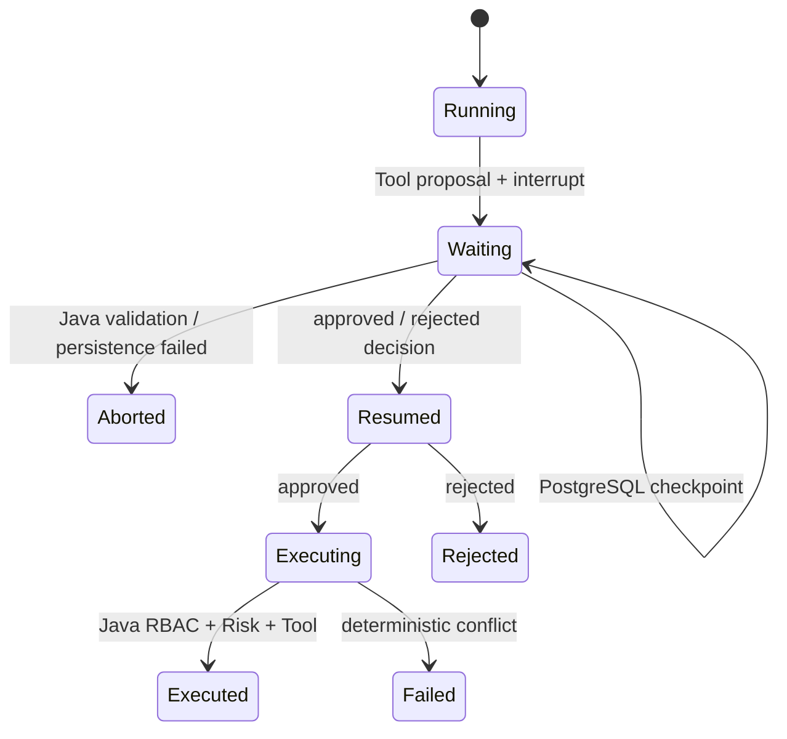

# Agent Runtime：持久化中断与恢复

- 状态：Implemented
- 所属阶段：V2-07
- 相关 ADR：ADR-0009、ADR-0011、ADR-0021、ADR-0022、ADR-0037、ADR-0038、ADR-0039

## 用户价值

当 Agent 提出需要人工确认的业务动作时，等待状态不再依赖某个 Python 进程。即使 Agent Service 在确认前重启，用户仍可确认或拒绝原动作；系统恢复同一 Thread，并保证 Java 最多执行一次业务写入。

## 目标流程

```mermaid
stateDiagram-v2
    [*] --> Running
    Running --> Waiting: Tool proposal + interrupt
    Waiting --> Waiting: PostgreSQL checkpoint
    Waiting --> Aborted: Java validation / persistence failed
    Waiting --> Resumed: approved / rejected decision
    Resumed --> Executing: approved
    Resumed --> Rejected: rejected
    Executing --> Executed: Java RBAC + Risk + Tool
    Executing --> Failed: deterministic conflict
```

1. Python 完成 Context、Retrieval、Tool planning 和回答生成。
2. 仅当存在有效 Tool proposal 时，Action workflow 以完整 Memory Namespace 派生的稳定物理 thread key 写入 checkpoint 并动态 interrupt；每次新等待轮次生成不可复用的内部 `workflowId`，对外 Thread 标识仍是 `conversationId`。
3. Python 在内部 proposal 中返回本轮 `workflowId`；Java 校验 proposal、以该 ID 幂等持久化唯一 PENDING Approval，并把不含 workflow ID 的公共 pending action 返回用户。
4. 用户 confirm/reject 后，Java 重新验证 Project、当前决策 actor 和服务端 Tool Policy，并先以当前 actor 追加审计、持久化决定；ADMIN 可代替 Action 原请求人决策。
5. Java 使用持久化的 Action 原请求人作为 checkpoint owner，把其 user ID、当前 actor 的管理员标记、workflow、action、decision 和 Idempotency Key 发送给 Python Resume 接口。
6. Python 从 PostgreSQL 恢复相同 Thread，并要求 workflow ID 精确匹配当前等待轮次；批准恢复成功后 Java 再锁定 Approval、再次复核权限并执行 Tool。
7. 任一网络响应丢失时，相同 key 重试返回已提交事实；不同 key 或相反 decision 冲突。

若 proposal 未形成 Java PENDING Action，Core 使用完整 Namespace、request ID 和可用的 workflow ID 调用内部 Abort。Python 只允许当前 WAITING 进入 `ABORTED`，并保留历史；错 request/workflow、已 RESUMED 或其它轮次均失败关闭。新会话的 conversation ID 在 Core 调用 Python 前按 project/user/request ID 稳定派生，因此相同 `X-Request-Id` 的响应丢失重试仍定位同一轮。

## 状态与隔离

checkpoint 只保存恢复所需的受限状态：schema version、tenant/workspace/project/user/thread、不可复用 workflow ID、proposal 指纹、等待/恢复/补偿状态、action ID、decision、Idempotency Key 和 request ID。不得保存 JWT、服务间 token、密码、完整 Prompt、回答正文或检索正文。

Thread 恢复必须同时匹配完整 Memory Namespace 和本轮 workflow ID。仅知道 conversation ID 或旧 Action ID 不能跨 Project/User/轮次恢复。等待期间只有相同 request 与相同 proposal 的重试返回原 workflow；不同 request 即使 proposal 内容相同也冲突。恢复完成后的新 proposal 建立新的 workflow ID，同时保留 LangGraph checkpoint 历史。

checkpoint owner 与审批执行者是不同身份：owner 固定为 Action 创建时由 Java 保存的 `requestedByUserId`，用于定位 Python Namespace；审批授权、审计和业务执行使用当前认证 actor。普通用户只能决定自己的 Action，ADMIN 可代审批，但管理员 user ID 不替换 owner，也不作为恢复 Namespace。

## 一致性与重试

Java 不在数据库事务或 action 行锁内调用 Python。confirm 分为：

1. `PENDING → APPROVED` 与审计提交；
2. Python Resume；
3. Java 锁定 APPROVED action、重新授权并执行，提交 `EXECUTED | FAILED` 与审计。

因此 Python 不可用时 Approval 可稳定保留为 APPROVED，并由相同 key 重试。Python 已恢复但 Java 尚未执行时，重复 Resume 返回相同完成事实，随后 Java 继续幂等执行。业务写入的最终正确性仍由 Java 行锁、唯一约束、状态机和 V2-06 Idempotency Key 保证。

reject 先提交 REJECTED，再恢复 Python 为 rejected；Python 暂时不可用时相同 key 可重试恢复，但 rejected action 永远不能执行。

V2-07 之前已持久化的 V2-06 Action 没有 checkpoint。V8 以可空 `action_workflow_version` 区分这些旧记录：旧记录继续沿用 Java 原有的确定性 confirm/reject，不调用不存在的 Resume。既有 V2-07 Action/checkpoint 保持版本 1 和无 workflow ID 的兼容恢复；本修复后的新 Chat Action 标记版本 2，并强制校验持久化 workflow ID。版本与 workflow ID 均不进入公共 API。

## 失败语义

- checkpoint 数据库不可用：Agent Service 启动或待决 Action 请求失败，不退回内存 checkpoint。
- Thread/Namespace/workflow/action 不匹配：内部 Resume 返回冲突或不存在，不尝试新建运行态，也不消费当前等待轮次。
- checkpoint schema version 不受支持：失败关闭并保留原 checkpoint，等待显式迁移策略。
- Python Resume 暂时失败：公共决定返回依赖不可用；Java 已提交的 Approval 决定不回滚。
- Java 未形成 Approval：Core 精确 Abort 当前 WAITING；Abort 失败显式返回依赖不可用，不伪装成普通回答。
- Tool 的版本冲突或目标资源已删除：Java 提交 FAILED；若真实乐观锁冲突直到 flush 才暴露，先回滚整个业务执行事务，再由事务外 Workflow 以新的短事务收敛仍为 APPROVED 的 Action 与 FAILED 审计。数据库、网络等未知基础设施异常不永久封死 Action，事务回滚后保持可安全重试的既有 APPROVED 状态。

## 测试边界

- Agent Service Internal HTTP 与 Action workflow 的公开 invoke/state 接口。
- 两个独立 runtime 共享真实 PostgreSQL 的重启恢复测试。
- Core confirm/reject HTTP 和 application orchestration。
- Java/Python 真实跨进程 restart/resume/execute smoke。

## 已知限制

V2-07 只持久化待决 Action workflow，不把 V2-03 的整个进程内 Conversation Summary 迁入 checkpoint。没有自动保留清理、管理 UI、任意 time travel、跨区域复制或通用异步任务队列。
