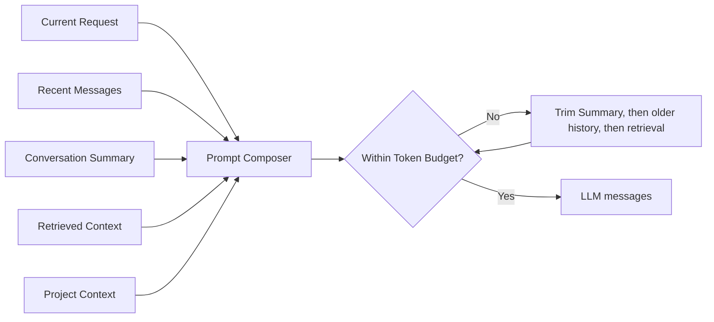

# Context Management

- 状态：Implemented
- 所属阶段：V2-02、V2-03
- 相关架构：`../02-architecture/system-overview.md`

## 工程目标

Context Manager 把一次 Agent 请求中“模型应该看到什么”从 LangGraph 的流程状态中分离出来。它不是 Prompt 美化器，也不负责业务授权；其目标是让 Working、Conversation、Project、Retrieved 与 Tool Context 有稳定结构、明确来源和单一组合入口。

## ContextBundle

| 部分 | 当前内容 | 生产者 | 消费者 |
| --- | --- | --- | --- |
| Working Context | 规范化后的当前用户消息 | prepare / Context Manager | Retrieval、Tool Planner、Responder |
| Conversation Context | conversationId、Recent Messages、可空 Summary | 进程内有界 conversation store | Prompt Composer；不进入 Retrieval 或 Tool Planner |
| Project Context | project、user、admin、request 标识 | 已通过 Java 授权的内部 Chat 请求 | Retrieval、Trace 关联 |
| Retrieved Context | 项目内检索文本与结构化 sources | Retrieval Node | Responder、API response |
| Tool Context | 本次确定性 Tool proposal | Tool Planner | API complete/response；不进入模型 messages |

`ContextBundle` 仅存在于 Python Agent Service 内部，不进入公共或内部 HTTP schema。Context Manager 创建初始 bundle，并以整体替换方式更新 Retrieved/Tool 部分，避免 Node 直接维护一组同级散落字段。

## State 与 Context 边界

LangGraph State 保存请求入口字段、当前 `ContextBundle` 和流程输出 `answer`。入口原始字段只供 Context Manager 建立 bundle；prepare 后的 Retrieval、Planner 和 Responder 从 bundle 读取数据。Context 是模型/Agent 决策所需资料，State 是图执行期间传递这些资料与结果的载体，两者不能混为同一概念。

Project Context 显式携带每次已授权请求的 project/user 边界。Retriever 仍必须把该 project ID 传给 Core 来源 API 和 RAG Store；Context Manager 不能使用全局当前项目、上一次请求或浏览器状态。Tool proposal 保存在 Tool Context，但不自动追加到 Working/Conversation messages，也不允许循环进入后续 Prompt。

## 同步与流式路径

同步 `/internal/v1/chat` 与流式 `/internal/v1/chat/stream` 使用同一个 prepare/retrieve/plan Context 过程。同步路径随后执行 responder；流式路径把已构建的 bundle 交给模型原生 stream。二者返回既有 conversation、request、sources、answer/proposal 契约，不新增 ContextBundle 字段。

V2-03 中，prepare 按 conversationId 从同一个 store 读取历史快照；快照包含不进入 Prompt/API 的内部 session generation，完成提交必须与 conversationId、project/user scope 和 generation 同时匹配。同步回答成功后提交完整 exchange，流式回答只有在 delta 全部生成并准备发送 `complete` 时提交。失败、中断、执行期间发生的 LRU 淘汰或重绑不写入半条或跨作用域 assistant message。新 conversationId 在首次请求时绑定 projectId/userId，后续作用域不匹配会拒绝使用；这只是当前会话安全绑定，不代表 V2-04 namespace 已实现。

## Conversation Summary 与 Token Budget

Recent Messages 保存最近 `AGENTFORGE_AGENT_CONTEXT_RECENT_TURNS` 轮 user/assistant exchange；单条历史副本以总 Context Budget 为存储上限，超长内容只在后续历史副本中截断，不改变当前响应。更早的原始消息转成带角色的确定性摘要条目，并受 `AGENTFORGE_AGENT_CONTEXT_SUMMARY_TOKEN_BUDGET` 限制。摘要不会再次作为待总结消息输入，因此不会形成 Summary 总结自身的递归链；Tool proposal/result、Retrieved Context 和异常正文从不直接进入摘要。

最终模型输入按以下逻辑组合：

Prompt 中的展示顺序保持 `Current Request → Recent Messages → Conversation Summary → Retrieved Context → Project Context`。预算检查覆盖实际发送的 System 与 Human messages，而非只计算历史字段。裁剪优先移除 Summary，再移除较旧 Recent Messages，最后才缩减 Retrieved Context；历史不能把当前检索结果挤出 Prompt。ContextBundle 内的 projectId、userId、requestId 只供授权后路由、检索与 Trace 关联，不发送给外部模型；Prompt 的 Project Context 只说明资料已限定至授权项目以及调用者角色，不包含内部标识、浏览器或其他会话的隐式状态。

## 安全与失败

- Java 仍在调用 Python 前完成认证、项目权限和配额；Context Manager 不替代授权。
- Retrieved Context 只接受当前 project 的检索结果；跨项目负向测试继续由 RAG seam 保证。
- Tool Context 只保存白名单 planner 的结构化意图，Python 不执行写入。
- Context 正文不进入 Langfuse metadata；Trace 继续只记录白名单状态与数量。
- Context 构建或检索失败沿用现有 422/503 与脱敏错误行为。
- Conversation store 有 session 数量上限并按最久未使用淘汰，避免 Prompt 受控但进程内存无限增长。
- 同步路径的 scope/generation 冲突返回脱敏 422；流式响应若已开始则以安全 `error` 事件结束且不发送 `complete`。

## 测试边界

通过 LangGraph/FastAPI 公共入口断言 prepare 后各 Node 消费同一个 bundle、同步与流式输出一致、project 标识显式传给 Retriever、成功后提交且失败不提交。通过 Context/store 公共接口验证 scope 绑定、LRU 上限、Recent/Summary 生命周期与 Tool 排除。通过 Responder 的模型 boundary fake 检查最终 sections、Token Budget、检索保护以及同步/流式使用同一组合结果。

## 已知限制

V2-03 的会话状态只在当前 Agent Service 进程内有效，多实例不共享且重启会清空。它不提供跨 tenant/workspace/project/user/thread 的完整 Memory Namespace，也不提供数据库恢复；V2-04 与后续持久化节点分别处理这些边界。TokenCounter 使用 UTF-8 字节数作为跨 provider 的保守 Token 上界，并计入每条模型消息的固定开销；它不会低估常见 byte/subword tokenizer，但通常高于账单 Token，因此文档和公开材料不宣称未经真实测量的节省比例。
