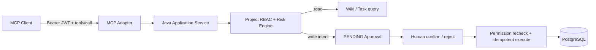

# MCP Adapter

- 状态：Implemented（V3-01）
- 所属阶段：V3-01
- 相关 ADR：ADR-0019、ADR-0021、ADR-0029

## 用户价值与使用场景

外部 Agent 可以用 MCP 发现 AgentForge 的项目 Wiki 与 Task Tool，不需要耦合产品私有 Controller。协议适配不改变权限事实：Java 继续决定 actor、project、risk、approval 和最终业务写入。

## 范围与非目标

首批 Tool 为 `search_wiki`、`get_task`、`create_task`、`update_task`。只实现 Tools 能力和 Streamable HTTP；不提供 Resources、Prompts、Sampling、MCP Client、OAuth Authorization Server 或模型路由。

## 关键流程

`search_wiki` 首版在当前项目已授权的 Wiki 标题和正文中做不区分大小写的子串匹配，返回页面摘要；不保证相关性排序，暂不分页或限制结果数。它与内部 Agent 的混合检索语义不同。读 Tool 在认证和 ProjectAccess 后返回 DTO。写 Tool 只保存服务器规范化后的业务参数并返回 Approval；MCP 调用本身不是人工确认。写 Tool 必须提供 1–100 字符的 `idempotencyKey`；同一 project/user/key 和相同意图返回原 Approval，复用 key 提交不同意图返回冲突。

## 接口

`/mcp` 使用 MCP `2025-11-25` Streamable HTTP。每次 HTTP 请求必须携带有效 AgentForge Bearer JWT。Tool 定义包含稳定 name、description 与 JSON Schema；调用结果使用 MCP content 与 structured content，参数/可恢复业务错误返回 `isError=true`。

写 Tool 首次调用返回 `status=PENDING`；同一提案幂等键重试返回原 Approval 的当前状态（也可能已是终态）。结果包含 `approvalId`、`status`、`actionType`、`riskLevel` 与安全预览。人工决定继续使用 Core API confirm/reject，confirm 要求 `Idempotency-Key`。

## 数据

Approval 增加可信 `source=CHAT|MCP`。CHAT 必须有 conversationId；MCP 不伪造 conversation/checkpoint，`action_workflow_version` 为空。Task 结果仍由既有 `TaskService` 产生。

## 权限与安全

- JWT subject 和 roles 形成 `AuthenticatedActor`；Tool 参数不能覆盖。
- projectId 与资源 ID 同时进入 Java Application Service，防止跨项目读取或修改。
- Tool Risk Metadata 只来自 `ToolRiskEngine`。
- MCP 写 Tool 不执行 Task、不提供 MCP confirm Tool；MCP 来源 Action 禁止使用 60 秒低风险自动确认入口，必须由用户显式 confirm/reject。
- 错误不得包含 JWT、内部 token、数据库细节、堆栈或未经授权资源内容。

## 失败与排查

认证失败在 HTTP 边界返回 401。参数或可修正领域错误在 MCP Tool Result 中标记错误；意外基础设施错误使用协议错误并记录 requestId。排查优先关联 requestId、actor/project、tool name 和 approvalId，不记录完整敏感参数。

## 测试与验收

通过 `/mcp` 的 `tools/list` / `tools/call`、Core confirm/reject、公共 Wiki/Task API 与真实 PostgreSQL seam 验证 Tool Schema、授权隔离、写前无业务变更、人工确认后最多执行一次、版本冲突、拒绝和错误契约。

## 已知限制与后续计划

官方 Java SDK 2.0.1 当前支持 MCP `2025-11-25`；升级到 `2026-07-28` 等待 Java SDK 稳定支持。首版客户端需要预先获得 AgentForge JWT，不支持 OAuth 自动发现和授权码流程。
