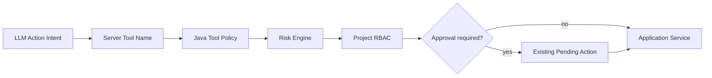

# Security and Risk

- 状态：Implemented
- 所属阶段：V2-05
- 相关 ADR：ADR-0019

## 用户价值与使用场景

用户可以让 Agent 读取项目资料或提出业务动作，同时确信模型不能自行扩大权限。相同业务动作无论来自 Agent Intent 还是直接 Core API，都由 Java 的确定性服务执行 Project、Role 与 Risk 校验。

## 范围与非目标

V2-05 建立 `READ / LOW / MEDIUM / HIGH` 风险等级和集中式 Tool Metadata：`required_role`、`risk_level`、`need_approval`。首批策略覆盖 `search_wiki`、`get_task`、`create_task`、`update_task`、Wiki/Task 修改与删除。V2-06 的通用审批、审计和幂等不在本节点。

## 关键流程

Java 只信任认证 JWT、数据库中的 Project/资源归属和服务端 Tool Policy。Python proposal 只包含动作名与业务参数；额外的 role/risk/approval 字段不能改变策略。执行时仍重新读取真实项目和目标资源。

## 策略矩阵

| Tool / Operation | Risk | Required role | Agent approval |
| --- | --- | --- | --- |
| `search_wiki`, `get_task` | READ | USER | no |
| `create_task` | LOW | USER | yes，沿用现有确认票据 |
| `update_task`, Wiki/Task 普通修改 | MEDIUM | USER | yes for Agent intent |
| Wiki/Task delete | HIGH | ADMIN | yes；V2-05 不开放 Agent 删除 Tool |

`need_approval` 描述 Agent 自动执行边界；用户直接调用明确的写 API 仍必须经过相同角色与风险检查，但不创建伪造的 Agent approval。V2-06 已为 Agent Task Action 增加五态 Approval、显式幂等确认和追加式审计。

## 接口与数据

策略是 Java 代码中的不可变注册表，不来自数据库或公共请求。公共 HTTP schema 不暴露可写的 Tool Metadata。拒绝角色或项目访问返回 403；未知 Tool Intent 被丢弃且不写业务数据。

## 权限与安全

- `USER` 只访问自己拥有的 Project；`ADMIN` 仍需通过 ProjectAccess，但可执行 HIGH 操作。
- 资源 ID 必须与路径 projectId 同时查询，防止 IDOR。
- Risk Engine 不能替代应用服务的实体版本、字段和状态校验。
- Prompt Injection 不能改变 JWT actor、projectId、Tool Metadata 或 Java 执行分支。

## 测试与验收

通过 Risk Engine 公共接口、Core HTTP、Agent proposal 和真实 PostgreSQL seam 验证角色矩阵、跨项目/跨用户拒绝、未知 Tool、伪造 Metadata、直接 API 绕过及授权先于读取/写入。

## 已知限制与后续计划

当前角色仍为 USER/ADMIN 与 owner-or-admin 项目模型；Approval payload 首版仅覆盖 CREATE_TASK/UPDATE_TASK。V3 MCP 也必须复用该 Java 策略。
